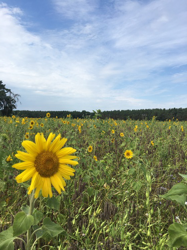
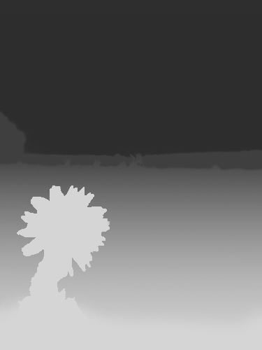

# depth-map-tool-swift

Simple command line utility written in Swift that takes a PNG image and a PNG depth map and combines them into a singe HEIC image with depth channel.

## Usage

```sh
./depth-map-tool-swift base-image.png depth-map.png output.heic
```

Checking the output image using `heif-info` from the `libheif` package:

```
> $ heif-info output.heic
MIME type: image/heic
main brand: heic
compatible brands: heic, mif1

image: 375x500 (id=1), primary
  colorspace: YCbCr, 4:2:0
  bit depth: 8
  color profile: nclx
  alpha channel: no
  depth channel: yes
    size: 188x250
    bits per pixel: 8
    z-near: undefined
    z-far:  undefined
    d-min:  1.762695
    d-max:  5.894531
    representation: uniform disparity
    disparity_reference_view: 0

...
```

## Example depth map


